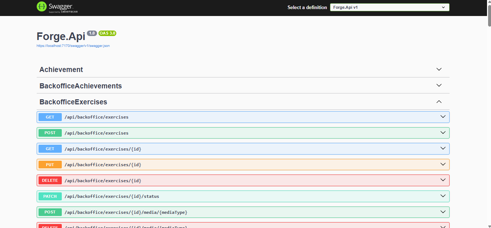
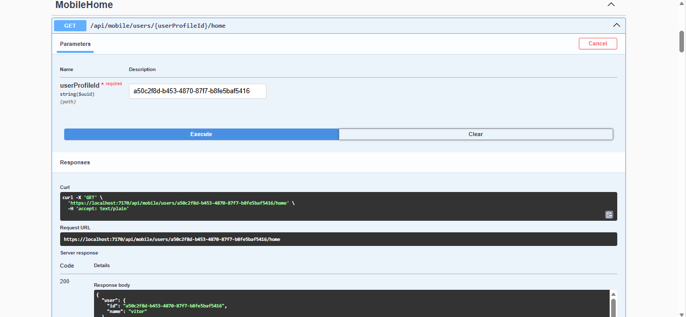

# Forge API

Backend da plataforma Forge desenvolvido com **ASP.NET Core 8**, responsável por gerenciar treinos, exercícios, conquistas, progressão do usuário e integração com o Forge Mobile e o Forge Backoffice.

---

## ✨ Principais Funcionalidades

- API RESTful
- Clean Architecture
- Entity Framework Core
- SQL Server
- Swagger / OpenAPI
- Validação de dados
- Testes automatizados
- Integração com Forge Mobile e Forge Backoffice

---

## 📸 API Documentation

### Swagger Overview

<p align="center">
  
</p>

---

### Endpoint Example

<p align="center">
  
</p>

---

## 🏗️ Arquitetura

```text
Forge.Api
├── Forge.Api              → Controllers, Middleware e Configurações
├── Forge.Application      → Casos de uso e Serviços
├── Forge.Domain           → Entidades e Regras de Negócio
├── Forge.Infrastructure   → Entity Framework Core, SQL Server e Repositórios
└── Forge.Api.Tests        → Testes Automatizados
```

---

## 🚀 Tecnologias

- ASP.NET Core 8
- C#
- Entity Framework Core
- SQL Server
- Swagger / OpenAPI
- xUnit
- FluentAssertions
- Docker

---

## ⚙️ Configuração do Ambiente

### Pré-requisitos

- .NET SDK 8
- SQL Server
- Visual Studio 2022 ou Visual Studio Code

---

## ▶️ Executando o Projeto

```bash
git clone <repository-url>

cd Forge.Api

dotnet restore

dotnet ef database update

dotnet run
```

---

## 🧪 Executando os Testes

```bash
dotnet test
```

---

## 📌 Roadmap

- ✅ API para Forge Mobile
- ✅ API para Forge Backoffice
- ✅ Sistema de Exercícios
- ✅ Sistema de Treinos
- ✅ Sistema de Conquistas
- ✅ Sistema de Progressão (XP)
- 🔄 Autenticação JWT
- 🔄 Deploy em Produção